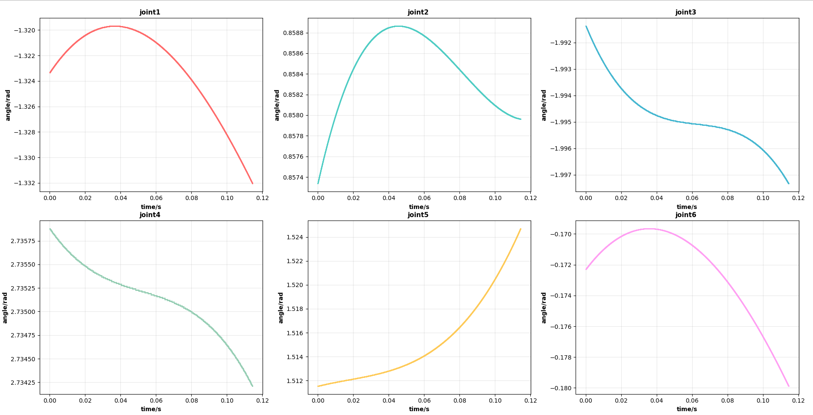
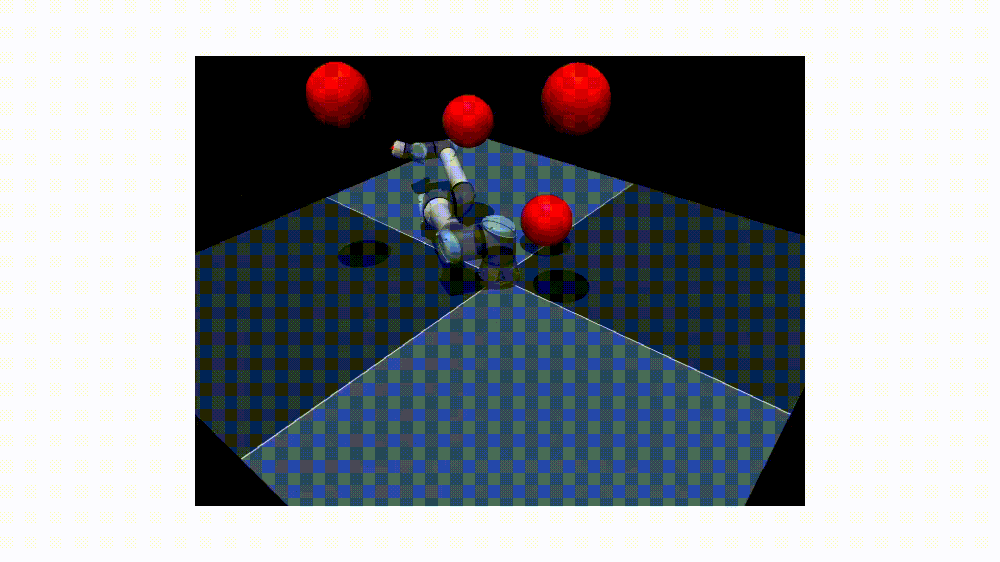
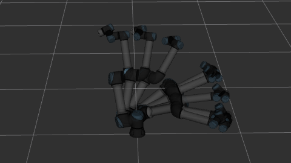
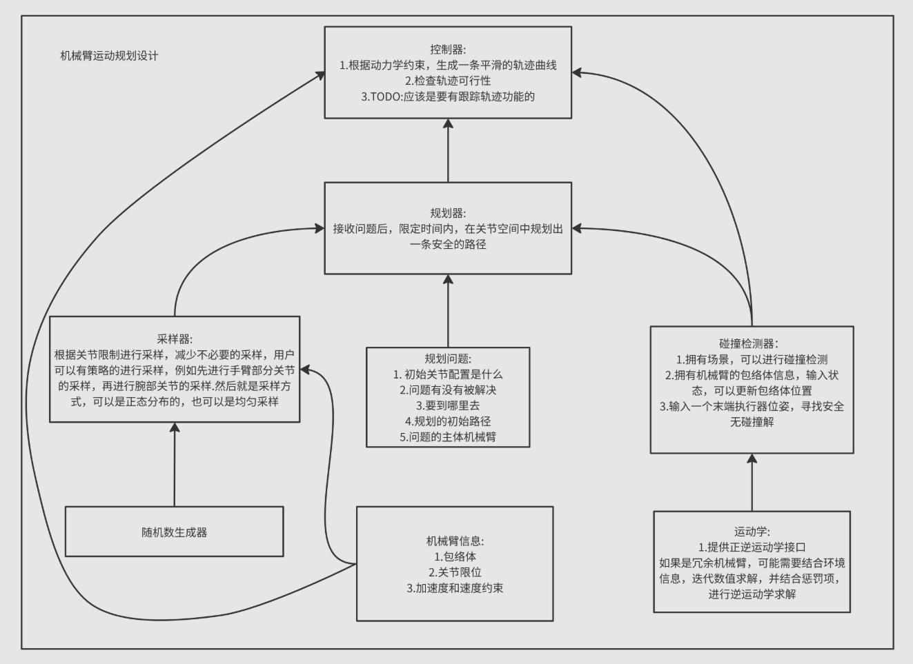

# Fast_Motion_Planning

**Fast_Motion_Planning**是一个运动规划框架，作者自己写了一个针对于UR5E的运动规划，其实也可以迁移到其他机械臂上

## Features

- kd树改进版实现碰撞检测
- 轨迹可视化模块(规划算法验证)

  
   
    

## Framework Design

  

## Contact Way

- 📧 Email：Jup230551@outlook.com
- 🔗 GitHub：
