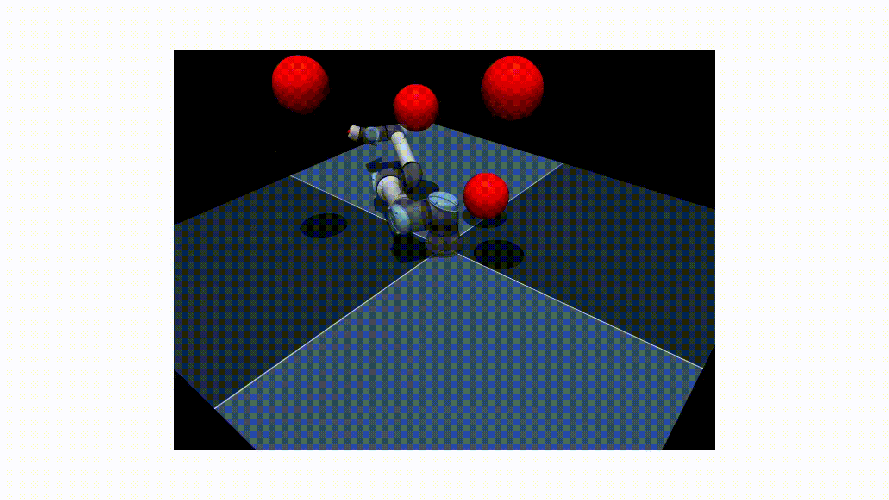
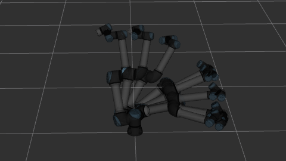
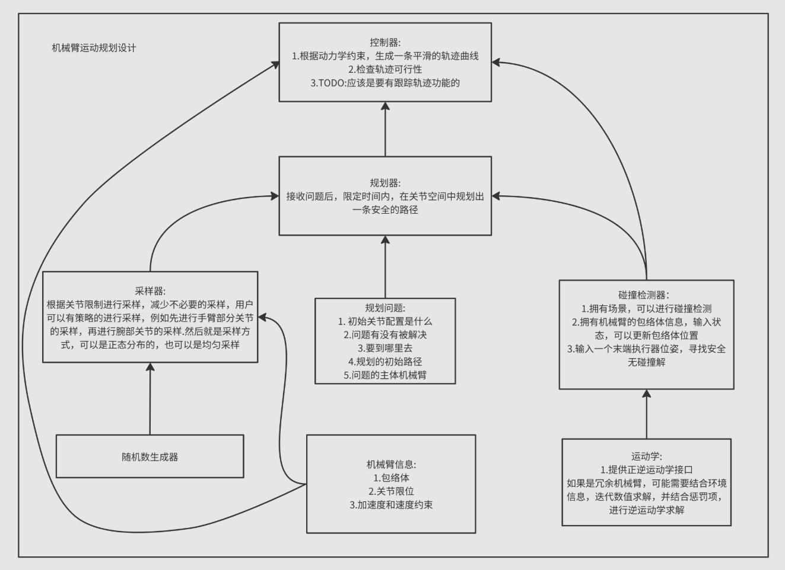

# Motion_Planning_Tutorial

**Motion_Planning_Tutorial**是一个基础性的一个教程库，用于后续实验室工程机器人算法方向的培养

<p align="center">
  
   
    
</p>

## Framework Design

<p align="center">
  
</p>

## Quick Start

```sh
git clone https://github.com/Ju-yzp/robotic_manipulation.git
cd robotic_manipulation
colcon build
source install/setup.bash #加载环境变量,避免包路径没有被设置，导致纹理文件无法加载
```
