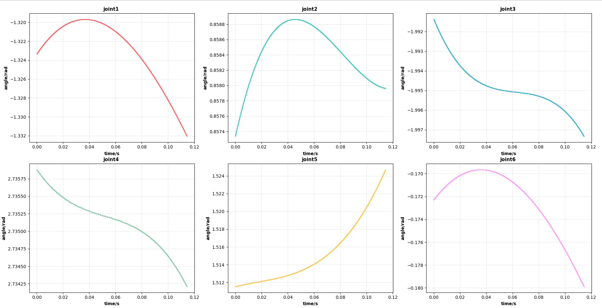

# Motion_Planing_Tutorial

**Motion_Planing_Tutorial**是一个基础性的一个教程库，用于后续实验室工程机器人算法方向的培养

<p align="center">
  
</p>

## Quick Start

```
git clone https://github.com/Ju-yzp/robotic_manipulation.git
cd robotic_manipulation
colcon build
```