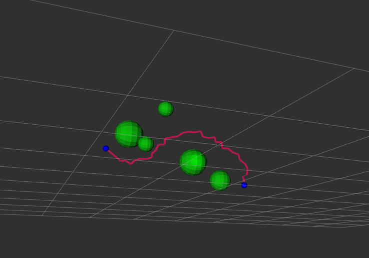

# Path Planner


## Project Summary
本项目为实现一个路径规划器，通过优化后的RRT *算法，为机器臂寻找一条从当前所在点到目标点的路径，同时避开障碍物。



我们主要有python、cpp两个版本，python版本用于验证和可视化障碍物和路径，cpp为正式版本（接入ros2通信框架后考虑加入maker，实现轨迹可视化）。

后面会加入八叉树建图模块，同时使用自定义插件将机械臂本体抽象为多个球形，引入多线程，实现一个实时轨迹规划系统。

## Quick Start

```bash
cd src/path_planer/cpp/build
cmake ..
make
```

## Thanking

参考论文：

【1】刘春，罗继祥. 用于三维空间避障的 HDCS-RRT*算法机械臂运动规划研究[J]. 机械科学与技术，2024，43（12）：2105-2113

【2】邱宏波，司徒仕忠，高萌，孔德良，冯桑。基于深度相机的机械臂动态避障研究 [J]. 机械科学与技术，2022, 41 (10): 120 - 123. DOI:10.13462/j.cnki.mmtamt.2022.10.026

## Idea

在RRT *的数据结构层面上，我们可以设计一种快速寻找邻域的树，避免循环整个树才能找出最近节点。